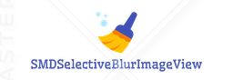

# SMDSelectiveBlurImageView



[](https://twitter.com/gajjartejas)
[](https://github.com/gajjartejas/SMDSelectiveBlurImageView/blob/master/README.md)
[](https://github.com/gajjartejas/SMDSelectiveBlurImageView)
[](http://cocoadocs.org/docsets/SMDSelectiveBlurImageView/)

A Clouser based UIImagePickerController wrapper in Swift.
***

[](Images/animation.gif)

## Demo

Do `pod try SMDSelectiveBlurImageView` in your console and run the project to try a demo.
To install [CocoaPods](http://www.cocoapods.org), run `sudo gem install cocoapods` in your console.

## Installation 📱

This branch supports Swift 4.

### CocoaPods

Use [CocoaPods](http://www.cocoapods.org).

1. Add `pod 'SMDSelectiveBlurImageView'` to your *Podfile*.
2. Install the pod(s) by running `pod install`.
3. Add `import SMDSelectiveBlurImageView` in the .swift files where you want to use it

### Source files

A regular way to use SMDSelectiveBlurImageView in your project would be using Embedded Framework. There are two approaches, using source code.

Add source code:

1. Download the [latest code version](https://github.com/gajjartejas/SMDSelectiveBlurImageView/archive/master.zip).
2. Unzip the download file, copy `SMDSelectiveBlurImageView` folder to your project folder

After you get the source code either by adding it directly or using submodule, then do the following steps:

- Open `SMDSelectiveBlurImageView` folder, and drag `SMDSelectiveBlurImageView.xcodeproj` into the file navigator of your app project, under you app project.
- In Xcode, navigate to the target configuration window by clicking the blue project icon, and selecting the application target under the "Targets" heading in the sidebar.
- Open "Build Phases" panel in the tab bar at the top of the window, expend the "Target Dependencies" group and add `SMDSelectiveBlurImageView.framework` under SMDSelectiveBlurImageView icon in the popup window by clicking `+`. Similarly, you can also add `SMDSelectiveBlurImageView.framework` in "Embedded Binaries" under "General" tab.

## Basic usage ✨

```swift
import SMDSelectiveBlurImageView
